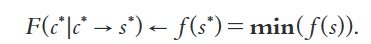

---
# 当前页面内容标题
title: 一般组合优化问题
# 当前页面图标
icon: linter
# 分类
category:
  - 目录
  - 导航
# 标签
tag:
  - 目录
  - 导航
sticky: false
# 是否收藏在博客主题的文章列表中，当填入数字时，数字越大，排名越靠前。
star: false
# 是否将该文章添加至文章列表中
article: false
# 是否将该文章添加至时间线中
timeline: false
---
## 英文
 
General Combinatorial Optimization Problem （GCOP）

## 英文释义

decision variables are a set of parametric algorithmic components.
The solutions of GCOP, i.e. compositions of algorithmic components, thus represent different generic search algorithms. The objective of GCOP is to find the optimal algorithmic compositions for solving the given optimization problems. Solving the GCOP is thus equivalent to automatically designing the best algorithms for optimization problems

## 中文释义

决策变量是算法组件。

GCOP的解，即算法组件的组成，代表了不同的通用搜索算法。GCOP的目标是寻找求解给定优化问题的最优算法组合。因此，求解GCOP等价于自动为优化问题设计最佳算法

## 问题模型

**决策变量**a：取自一个有限集合A，它的元素a为算法组件

**解空间**C：由a的算法组合c组成

**优化问题**：p。p的解空间为S，解为s∈S（s为离散解）。每一个s都由一个对应c组成。p的目标函数f(s)->R评价了s。

**目标函数**：F(c)->R, c∈C。衡量了c在p上的表现

**映射函数(mapping function)**: M, f(s)->F(c)

GCOP的目标是找到最优的 c*∈ C（对应s*∈S），从而使F(c*)是最优的。

## 来源

The General Combinatorial Optimization Problem: Towards Automated Algorithm Design p1
