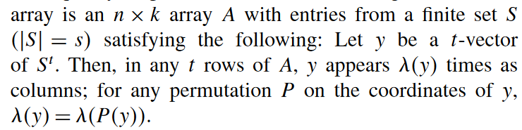

---
# 当前页面内容标题
title: 正交阵列
# 当前页面图标
icon: linter
# 分类
category:
  - 目录
  - 导航
# 标签
tag:
  - 目录
  - 导航
sticky: false
# 是否收藏在博客主题的文章列表中，当填入数字时，数字越大，排名越靠前。
star: false
# 是否将该文章添加至文章列表中
article: false
# 是否将该文章添加至时间线中
timeline: false
---
## 英文
 
orthogonal array

## 释义

太抽象了，直接贴图吧

## 来源

Fine-Tuning of Algorithms Using Fractional Experimental Designs and Local Search p6， 最后一段
