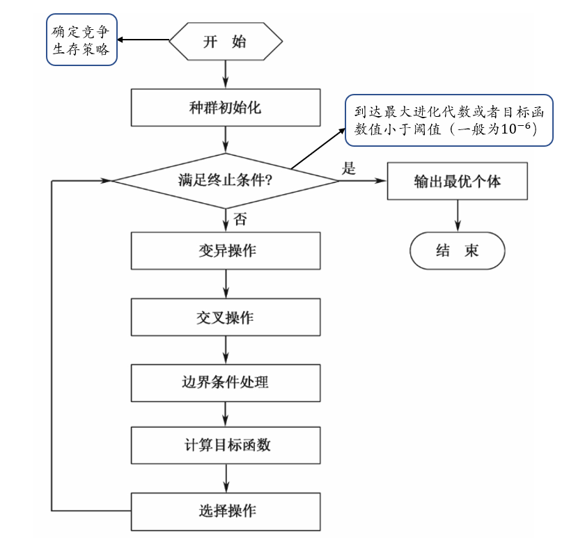
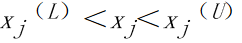
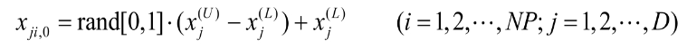
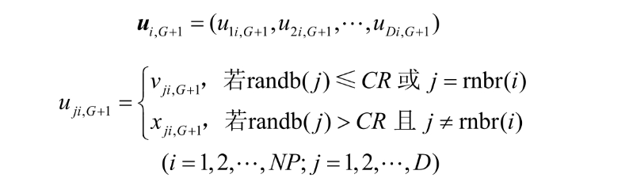

---
# 当前页面内容标题
title: 智能算法整理
# 当前页面图标
icon: linter
# 分类
category:
  - 目录
  - 导航
# 标签
tag:
  - 目录
  - 导航
sticky: false
# 是否收藏在博客主题的文章列表中，当填入数字时，数字越大，排名越靠前。
star: false
# 是否将该文章添加至文章列表中
article: false
# 是否将该文章添加至时间线中
timeline: false
---
## 差分进化算法（Differential Evolution，DE）概述

* Storn等人1995年提出
  
* 通过群体内<font color=DarkRed>个体</font>间的<font color=DarkRed>合作与竞争</font>而产生的智能优化搜索

* 保留了<font color=DarkRed>基于种群的全局</font>搜索策略。


    ps.来自师姐的解释：
    ```
    QY:
    一般而言，无论是DE还是GA  都是属于基于种群的全局搜索策略。

    QY:
    “基于种群的全局搜索策略”就是一种利用一群“候选解决方案”来共同寻找最佳解决方案的方法。这种策略会模拟自然选择和遗传等生物过程，通过不断的迭代，让整个“种群”向更好的解决方案进化，以此来尝试找到问题的全局最优解。
    ```
*  降低了进化计算的复杂性
     -  采用实数编码
    - 基于差分的简单变异操作
    - “一对一”的竞争生存策略

* 拥有记忆能力

## 理论基础

### 算法原理

* 随机的启发式搜索算法。从数学角度，是一种随机搜索；从工程角度，是一种自适应的迭代寻优过程。
* 自组织最小化方法。
* 利用种群中两个随机选择的不同向量来干扰一个现有向量，种群中的每一个向量都要进行干扰。
* 差分进化算法利用一个向量种群，其中种群向量的随机扰动可独立进行，因此是并行的。

* **变异**：把种群中两个成员之间的加权差向量加到第三个成员上来产生新的参数向量

* **交叉**: 将变异向量的参数与另外预先确定的目标向量参数按一定规则混合来产生试验向量

* **选择**：若试验向量的代价函数比目标向量的代价函数低，试验向量就在下一代中代替目标向量

种群中<font color=Crimson>所有成员</font>必须当作目标向量进行一次这样的操作，以便在下一代中出现相同个数竞争者


## 差分进化算法特点

1） 结构简单，易于使用。算子只涉及向量的加减运算；采用概率转移规则，不需要确定性的规则；控制参数少

2） 对于大空间、非线性和不可求导的连续问题，效率较好。可靠性、高效性、鲁棒性。

3） 自适应性。差分变异算子可以是固定常数，也可以是具有变异步长和搜索方向自适应的能力。

4） 并行性。差分进化算法利用一个向量种群，其中种群向量的随机扰动可独立进行，因此是并行的。

5） 算法通用。

 ## 差分进化算法主要参数

|关键参数|含义|作用|取值范围|
---------|---|----|--- |
|D|维数|||
|NP|群体规模|NP大，多样性好，寻优能力也就越强，但计算复杂度较高|5D~10D之间，必须≥4|
F|变异算子|实常数，F过小，可能造成算法“早熟”。随着F的增大，算法越不容易陷入局部最优；F＞1时，收敛性变得非常差。|0~2，一般在0.4~1有效，通常为0.5|
CR|交叉算子|CR越大，发生交叉可能性越大，CR越大收敛速度越快|0~1，较好选择为0.1|
G|最大进化代数|遗传运算结束条件参数|100~500|

## 差分进化算法运算流程



### 基本差分进化算法

 **初始化**：利用NP个维数为D的实数值参数向量进行初始化，一般在约束边界内随机选择。

个体表示：                                          
    
    
     其中，i表示个体在种群中的序列

变量边界：
    

随机选择常用方法：

   

 **变异**：

 

 **交叉**：

 

即，若编码第j位处按照概率CR(或j=随机选择的某个维度)变成$v_{ji,G+1}$。

 **选择**：按照贪婪准则。

    如果目标函数要被最小化，那么具有较小目标函数值的向量将在下一代种群中出现。下一代中的所有个体都比当前种群的对应个体更佳或者至少一样好。注意:在差分进化算法选择程序中，试验向量只与一个个体相比较，而不是与现有种群中的所有个体相比较。

**边界条件的处理**:  必须保证新的解在可行域内

    1）将不符合边界约束的新个体用在可行域中随机产生的参数向量代替。

    2）边界吸收处理，将超过边界约束的个体值设置为临近的边界值。

### 自适应差分进化算法

 在基本差分进化算法中，F为实常数，容易出现早熟现象。

 自适应算法中F为：


 还可以设计一个随机范围的交叉算子CR：
 


 ### 离散差分进化算法
改进用于整数规划和混合整数规划。


 ### 其他差分进化算法形式
 用符号DE/x/y/z加以区分

 |符号|含义|
---------|---|
|x|限定当前被变异的向量是“随机的”或“最佳的”|
|v|所利用差向量的个数|
|z|交叉程序操作方法|

基本算法的交叉操作为bin，它可以被描述为
DE/rand/1/bin。


