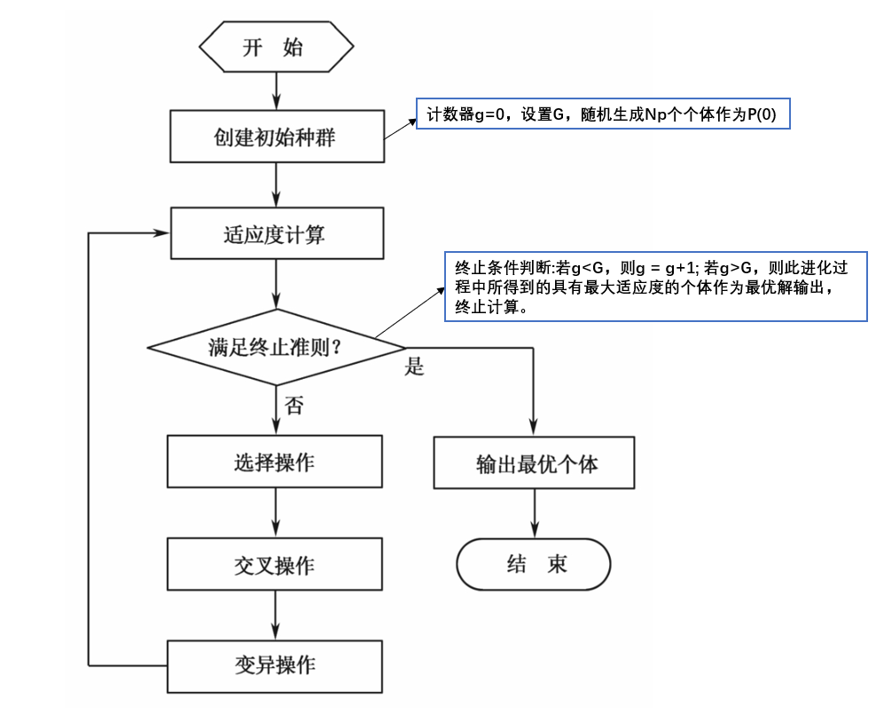
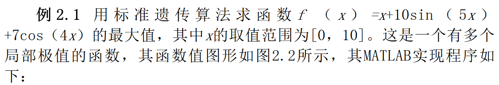

---
# 当前页面内容标题
title: 智能算法整理
# 当前页面图标
icon: linter
# 分类
category:
  - 目录
  - 导航
# 标签
tag:
  - 目录
  - 导航
sticky: false
# 是否收藏在博客主题的文章列表中，当填入数字时，数字越大，排名越靠前。
star: false
# 是否将该文章添加至文章列表中
article: false
# 是否将该文章添加至时间线中
timeline: false
---
## 遗传算法（Genetic Algorithm, GA）概述

* 模拟生物在自然环境中遗传和进化过程而形成的自适应全局优化搜索算法
  
* 鉴了达尔文的进化论和孟德尔的遗传学说

## 理论基础

### 模式定理

* **模式**：具有相似结构特点的个体编码字符串

  遗传算法的本质是对模式所进行的一系列运算

  长度为L的串，隐含着2^L个不同的模式

* **模式阶**：模式H中确定位置的个数称作该模式的模式阶，记作O(H)

  eg. 0*****的模式阶为1

  模式阶越高，确定性越高，样本数越少

* **定义距**：在模式H中第一个确定位置和最后一个确定位置之间的距离称为该模式的定义距，记作D(H)

* **模式定理（遗传算法基本定理）**：

   在遗传算法选择、交叉和变异的作用下，具有低阶、短定义距，并且其平均适应度高于群体平均适应度的模式在子代中将呈指数级增长

   根据模式定理，随着遗传算法一代一代地进行，那些定义距短的、位数少的、高适应度的模式越来越多，因而可期望最后得到的位串的性能越来越得到改善，最终趋向全局最优点

### 积木块假设

* **积木块** ：具有低阶、短定义距以及高平均适应度的模式称为积木块

  模式定理说明了积木块的样本数呈指数级增长

* **积木块假设**：

  个体的积木块通过选择、交叉、变异等遗传算子的作用能相互结合在一起，形成高阶、长距、高平均适应度的个体 编码串

  积木块假设说明了用遗传算法求解各类问题的基本思想，即通过基因块之间的相互拼接能够产生出问题的更好的解，最终生成全局最优解

  ### 总结

  从遗传算法的模式定理得到:具有高适应度、低阶、短定义矩的模式的数量会在种群的进化中呈指数级增长，从而保证了算法获得最优解的一个必要条件。而另一方面，积木块假设则指出:遗传算法有能力使优秀的模式向着更优的方问进化，即遗传算法有能力搜索到全局最优解。

  ## 基本概念

<table>
	<tr>
	    <th>术语</th>
	    <th>含义</th> 
	</tr >
  <tr>
	    <td>群体</td>
	    <td>可行解集</td>
	</tr>
  <tr>
	    <td>个体</td>
	    <td>可行解</td>
	</tr>
	<tr>
	    <td>染色体</td>
	    <td>可行解编码</td>
	</tr>
  	<tr>
	    <td>基因</td>
	    <td>可行解编码的分量</td>
	</tr>
    <tr>
	    <td rowspan="2">遗传编码</td>
	    <td>二进制编码：操作方便，计算简单；位串长度越长，精度越高。一般来说，编码精度越高，所得到的解的质量也越高，意味着解更为优良;但同时，由于遗传操作所需的计算量也更大，因此算法的耗时将更长。</td>
	</tr>
    <tr>
	    <td>实数编码：计算精确度高，便于和经典连续优化算法结合，适用于数值优化问题;但其缺点是适用范围有限，只能用于连续变量问题，。</td>
	</tr>
    <tr>
	    <td>适应度函数</td>
	    <td>用来评价个体优劣的函数</td>
	</tr>
	<tr>
	    <td rowspan="3">遗传操作</td>
	    <td>选择算子：根据一定规则/算法，选择较优的个体遗传。eg.轮盘赌</td>
	</tr>
	<tr>
	    <td>交叉算子</td>
	</tr>
		<tr>
	    <td>变异算子：实值变异（取值范围其他随机值）、二值变异（取反）</td>
	</tr>
</table>

## 遗传算法特点

1） 遗传算法以决策变量的**编码**作为运算对象。

2） 遗传算法直接以**目标函数值**作为搜索信息。它仅使用由目标函数值变换来的适应度函数值，就可确定进一步的搜索方向和搜索范围，而不需要目标函数的导数值等其他一些辅助信息。适合实际情况（实际中难以求导）。

3）遗传算法同时使用多个搜索点的搜索信息。遗传算法对最优解的搜索过程，是从一个由很多个体所组成的初始群体开始的，而不是从单一的个体开始的。隐含的**并行性**。

4）遗传算法是一种**基于概率**的搜索技术。遗传算法属于自适应概率搜索技术，其选择、交叉、变异等运算都是以一种概率的方式来进行的，从而增加了其搜索过程的灵活性。

5）遗传算法具有**自组织、自适应和自学习**等特性。当遗传算法利用进化过程获得信息自行组织搜索时，适应度大的个体具有较高的生存概率，并获得更适应环境的基因结构。同时，遗传算法具有可扩展性，易于同别的算法相结合，生成综合双方优势的混合算法。

## 遗传算法主要参数

|关键参数|含义|作用|取值范围|
---------|---|----|--- |
|NP|群体规模|太小时，遗传优化性能较差。较大的群体规模可以减小遗传算法陷入局部最优解的机会，但计算复杂度较高|10~200|
Pc|交叉概率|控制着交叉操作被使用的频度。较大时可以增强遗传算法开辟新的搜索区域的能力，但高性能的模式遭到破坏的可能性增大;太低时，遗传算法搜索可能陷入迟钝状态|0.25~1|
Pm|变异概率|辅助性的搜索操作，主要目的是保持群体的多样性。一般低频度的变异可防止群体中重要基因的可能丢失，高频度的变异将使遗传算法趋于纯粹的随机搜索|0.001~1|
G|遗传运算终止进化代数|遗传运算结束条件参数|100~1000|
X|决策变量，n个基因组成染色体|X=[X1,X2...Xn]，Xi为一个基因，可以是可以是一组整数，也可以是某一范围内的实数，或者是一个纯粹的记号；决策向量组成了问题的解空间。对问题最优解的搜索是通过对染色体搜索过程来完成的，所有的染色体就组成了问题的搜索空间||
P(t)|t时刻的群体,P(0)表示初始状态群体|||

## 遗传运算流程



### 标准遗传算法

 Standard Genetic Algorithm，SGA

 又称为经典遗传算法。

 **编码方式**：二进制编码

 **初始化**：初始种群个体的二进制串在一定字长的限制下随机产生。

 **交叉算子**：按交叉概率选中的两个染色体上，随机选中交叉位置，将两个染色体上对应于这些位置上的二进制数值进行交换

 **变异算子**：按变异概率随机选中的个体上，一般是随机选定变异位，将该位的二进制值取反

 ### 遗传算法的改进方向

 **缺点**：标准遗传算法存在局部搜索能力差和“早熟”等缺陷。

 **改进方向**：
 
 1）编码机制、选择策略、交叉算子、变异算子、特殊算子和参数设计(包括群体规模、交叉概率、变异概率)等。

 2）与差分进化算法、免疫算法、蚁群算法、粒子群算法、模拟退火算法、禁忌搜索算法和量子计算等结合起来所构成的各种混合遗传算法，可以综合遗传算法和其他算法的优点，提高运行效率和求解质量。

 ## 遗传算法的代码

 详情可以参考《智能优化算法及其MATLAB实例（第2版）》p35(函数极值、旅行商、背包)

 ### 求解函数的极值

 ```m
 %函数求极值
%%%f （ x ） =x+10sin （ 5x ）
clc;
clear;
close all;
NP = 50;    %种群数量
L = 20; %位数
Pc=0.8;  %交叉
Pm =0.1;  %变异
G=100; %最大遗传代数
Xs = 10;  %上限
Xx = 0; %下限
f = randi(2, NP, L)-1; %随机获得初始解
%%%%%遗传算法主循环%%%%%%%%%%
for k=1:G
%%%%%%%%%%将二进制解码为定义域范围内十进制%%%%%%
    for i = 1:NP
        U = f(i,:);
        m =0;
        for j= 1:L
            m = U(j) * 2^(j-1) + m; %获得第i个个体的十进制
        end
        x(i)= Xx + m*(Xs-Xx)/(2^L-1);%将数值约束到定义域内
        Fit(i)= func1(x(i));%计算适应度
    end
    maxFit =max(Fit);%最大值
    minFit =min(Fit);%最小值
    rr = find(Fit==maxFit);
    fBest=f(rr(1,1),:);%历代最优个体
    xBest =x(rr(1,1));
    Fit =(Fit-minFit)/(maxFit-minFit);%归一化适应度值
%%%%%%%基于轮盘赌的复制操作%%%%%%    
    sum_Fit=sum(Fit);
    fitvalue =Fit./sum_Fit;  %每个概率，适应度越高，概率越大
    fitvalue =cumsum(fitvalue);
    ms = sort(rand(NP,1));
    fiti = 1;
    newi =1;
    while newi <= NP
        if (ms(newi))< fitvalue(fiti)
            nf(newi,:)= f(fiti,:); %根据轮盘赌选择要复制的个体
            newi = newi+1;
        else
            fiti =fiti+1;
        end
     end
%%%%%%交叉操作%%%%%
    for i = 1:2:NP
        p = rand;
        if p < Pc   %以0.8的概率交叉
            q= randi(1,L); %随机选择位进行交叉
            for j=1:L
                if q(j)==1
                    temp =nf(i+1,j);
                    nf(i+1,j)= nf(i,j);
                    nf(i,j)= temp;
                end
            end
        end
    end
%%%%%%%变异操作%%%%%%%%%%%%%
    i = 1;
    while i<=round(NP*Pm)
    %随机选取一个需要变异的染色体
        h= randi(NP,1,1);
        for j= 1:round(L*Pm)
            g= randi(L,1,1);%随机选取需要变异的基因数
            nf(h,g)=~ nf(h,g);
        end
        i = i+1;
    end
    f = nf;
    f(1,:)= fBest;
    trace(k)= maxFit;
    %保留最优个体在新种群中历代最优适应度
end
xBest;
%最优个体
figure
plot(trace)
xlabel('迭代次数')
ylabel('目标函数值')
title('适应度进化曲线')

%%%%%%%%%%%%%%%%适应度函数%%%%%%%%%%%%%%%%%%%
function result= funcl(x)
    fit = x+10*sin(5*x)+7*cos(4*x);
    result = fit;
end
```