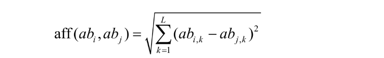
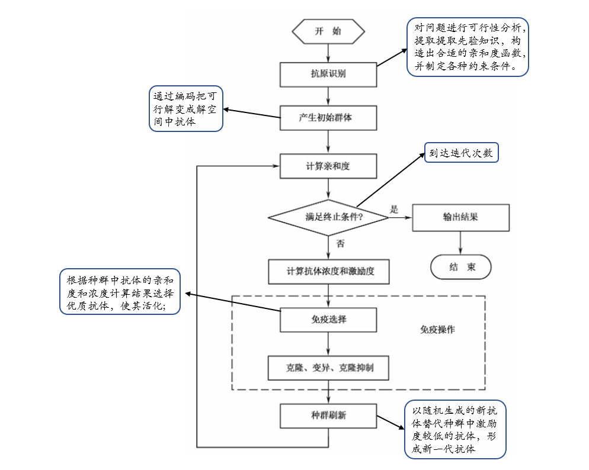

---
# 当前页面内容标题
title: 智能算法整理
# 当前页面图标
icon: linter
# 分类
category:
  - 目录
  - 导航
# 标签
tag:
  - 目录
  - 导航
sticky: false
# 是否收藏在博客主题的文章列表中，当填入数字时，数字越大，排名越靠前。
star: false
# 是否将该文章添加至文章列表中
article: false
# 是否将该文章添加至时间线中
timeline: false
---
## 免疫算法（Immune Algorithm，IA）概述

* 模仿生物免疫机制
  
* 用群体搜索策略

* 免疫算法利用自身产生多样性和维持机制的特点，保证了种群的多样性，克服了一般寻优过程(特别是多峰值的寻优过程)中不可避免的“早熟”问题，

## 理论基础

### 生物免疫系统

* **过程**：免疫是机体的一种生理反应，当病原体(即抗原)进入人体时，这些抗原将刺激免疫细胞(淋巴B细胞、T细胞)产生一种抵抗该病原生物的特殊蛋白质--抗体。抗体能将该病原生物消灭，并在将病原生物消灭之后，仍存留在人体内。当同样的病原生物再次侵入人体时，该病原生物就会很快地被体内存留的抗体消灭

* **相关概念**

|概念|含义|
----|---|
抗原|刺激机体启动免疫应答，即病毒之类的物质|
抗体|能够特异识别并清除抗原的免疫分子,B细胞产生|
B细胞|受到抗原刺激后，可浆化产生抗原，但不能识别大部分抗原|
T细胞|帮助B细胞产生抗原|
免疫识别|区分“自己”与“非己”|
免疫学习|识别是学习过程，结果是是免疫细胞的个体亲和度提高、群体规模扩大，并且最优个体以免疫记忆的形式得到保存。|
免疫记忆|免疫系统遇到相同或相似抗原，可以通过联想记忆提高应答速度|
克隆选择|免疫应答和免疫细胞的增殖在一个特定的匹配阈值之上发生。当淋巴细胞实现对抗原的识别，B细胞被激活并增殖复制产生克降B细胞，随后克隆细胞经历变异过程，产生对抗原具有特异性的抗体。

### 免疫算法

* 是一种确定性和随机性选择相结合并具有“勘探”和“开采”能力的启发式随机搜索算法。

* **相关概念**

|生物免疫系统|免疫算法|
----|---|
抗原|优化问题|
抗体（B细胞）|优化问题的可行解
亲和度|可行解质量
细胞活化|免疫选择
细胞分化|个体克隆
亲和度成熟|变异
克隆抑制|克隆抑制
动态维持平衡|种群刷新

* **算法模块**

1) 抗原识别与初始抗体产生——设计抗体编码规则，利用先验知识产生初始抗体种群

2) 抗体评价。根据抗体亲和度和个体浓度对抗体质量评价。优质抗体进行进化免疫操作，劣质被更新

3) 免疫操作。利用算子模拟生物免疫应答中的各种免疫操作

## 免疫算法特点

1） 全局搜索能力较强

2） 多样性保持机制。浓度高的抗体会被抑制

3） 鲁棒性。

4） 并行分布式搜索机制

 ## 免疫算法主要参数

|关键参数|含义|作用|取值范围|
---------|---|----|--- |
|NP|群体规模|NP大，多样性好，全局搜索能力也就越强，但计算复杂度较高|10~100，一般不超过200|
||免疫选择比例|比例越高，抗体越多，克隆越多，搜索能力越强，但计算量变大|一般取NP的10%~50%|
||抗体克隆扩增的倍数|数值越大，局部搜索能力越强，但计算量变大|一般5~10倍|
||种群刷新比例|影响全局搜索能力|一般不超过种群的50%|
G|最大进化代数|运算结束条件参数|100~500|

## 免疫算法算子

1)  **亲和度评价算子**

 * 类似遗传算法的适应度。
 * 通常是一个函数aff(x): S∈R，R为实数域，S为可行解区间
 * 基于欧式距离（实数编码）：

 

 * 基于海明距离的抗体-抗体亲和度计算方法（离散编码）：

2) **抗体浓度评价算子**

  为保持种群多样性，需要对抗体浓度过高的个体进行抑制

  抗体浓度：

  
  
  其中，N为种群规模，S(abi,abj)为抗体间的相似度

  

3) **激励度计算算子**

   通常亲和度较高、浓度较低的算子会得到较大激励

   

   

4) **免疫选择算子**

根据抗体激励值确定哪些抗体进入克隆选择操作

5) **克隆算子**

将免疫选择算子选中的抗体个体进行复制。克隆算子可以被描述为：

6) **变异算子**

变异算子对克隆算子得到的抗体克隆结果进行变异操作，以产生亲和度突变，实现局部搜索。

7) **实数编码算法变异算子**

在变异源个体中加入一个小扰动

8) **离散编码算法变异算子**

以二进制编码为主，其变异策略是从变异源抗体串中随机选取几位元，改变位元的取值(取反)

9) **克隆抑制算子**

对经过变异后的克隆体再选择，抑制亲和度低的抗体。

在克降抑制的过程中，克隆算子操作的源抗体与克隆体经变异算子作用后得到的临时抗体群共同组成一个集合，克隆抑制操作将保留此集合中亲和度最高的抗体，抑制其他抗体。

10) **种群刷新算子**

对种群中激励度较低的抗体进行刷新，从抗体种群中删除这些抗体并以随机生成的新抗体替代，有利于保持抗体的多样性，实现全局搜索，探索新的可行解空间区域

## 免疫算法运算流程

### 免疫进化算法种类

1）**克隆选择算法**

* 模拟免疫系统学习过程的进化算法

* 抗原被一些与之匹配的B细胞识别，这些B细胞分裂，产生的子B细胞在母细胞的基础上发生变化，以寻求与抗原匹配更好的B细胞，与抗原匹配更好的子B细胞再分裂……如此循环往复，最后找到与抗原完全匹配的B细胞，B细胞变成浆细胞产生抗体，这一过程就是克隆选择过程，克隆选择算法模拟这一过程进行优化

2）**免疫遗传算法**

* 改进的遗传算法
* 根据体细胞和免疫网理论改进了遗传算法的选择操作
* 在算法中加入免疫记忆功能
* 免疫遗传算法把抗原看作目标函数将抗体看作问题的可行解，抗体与抗原的亲和度看作可行解的适应度。
* 免疫遗传算法引入了抗体浓度的概念，并用信息来描述，表示群体中相似可行解的多少。
* 免疫遗传算法根据抗体与抗原的亲和度和抗体的浓度进行选择操作，亲和度高且浓度小的抗体选择率大，这样就抑制了群体中浓度高的抗体，保持了群体的多样性。

3）**反向选择算法**

 首先，产生一个检测器集合，其中每一个检测器与被保护的数据不匹配; 其次，不断地将集合中的每一个
检测器与被保护数据相比较，如果检测器与被保护数据相匹配，则判定数据发生了变化。

4）**疫苗免疫算法**

* 在遗传算法中加入免疫算子

* 包括疫苗接种和免疫选择两个部分。前者为了提高亲和度，后者为了防止种群退化。

* 随机产生NP个个体构成初始父代群体-->根据先验知识抽取疫苗-->计算当前父代种群所有个体的亲和度，并进行停止条件的判断-->对当前的父代群体进行变异操作，生成子代群体-->对子代群体进行疫苗接种操作，得到新种群-->对新群体进行免疫选择操作，得到新一代父本，并进入免疫循环。

