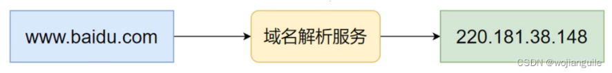
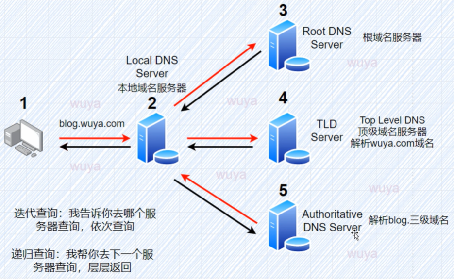

---
# 当前页面内容标题
title: 信息收集
# 当前页面图标
icon: linter
# 分类
category:
  - 目录
  - 导航
# 标签
tag:
  - 目录
  - 导航
sticky: false
# 是否收藏在博客主题的文章列表中，当填入数字时，数字越大，排名越靠前。
star: false
# 是否将该文章添加至文章列表中
article: false
# 是否将该文章添加至时间线中
timeline: false
---
## 信息收集包含内容

   域名信息、IP段、开放的端口、网站架构、软件版本、WAF、旁站、文件目录架构、C段...

## 域名信息

### 域名是什么

Domain name

eg. IP地址为192.168.1.110，难以记忆，因此用域名来代替。如baidu.com用来代替IP

### 域名的分类

#### 国际域名
|域名| 范围 |
|--|--|
|.com  |  商业公司|
|.net|  网络服务|
|.org|组织协会|
|.edu|教育机构|
|.gov|政府部门|
|.mil|军事领域|
|.int|国际组织|

#### 国别域名

|域名| 范围 |
|--|--|
|.cn  |  商中国|
|.UK|  英国|
|.US|美国|

#### 新顶级域名

biz, info, name, pro,aero...

### 域名与IP



### 查询域名

#### 域名联系人信息
所属人、邮箱、电话、地址...

 - WHOIS 查询

[阿里云](https://whois.aliyun.com/?spm=5176.27906258.J_9945901770.functions-listName1-cardsRight6.5d90575aeeRYQM)

不同域名由不同组织管理

- chinaz
[chinaz](https://www.chinaz.com/)

- whois soft

貌似无了

- cnnic

[cnnic](https://webwhois.cnnic.cn/WelcomeServlet)

- kali

kali中自带了whois 的命令

eg.

```
whois coolshell.cn
```

#### 域名反查

- chinaz域名反查

[注册人反查](https://whois.chinaz.com/reverse/register)

- ICP备案查询

[ICP备案](https://beian.miit.gov.cn/state/outPortal/loginPortal.action/#/Integrated/index)

chinaz也可以查询ICP备案

- 备案巴巴

[备案巴巴](https://www.beian88.com/)

（天眼查查询公司信息）

### 子域名

#### 子域名的作用

eg. 

百度搜索 www.baidu.com

      百度还有其他产品，百度地图、百度贴吧、百度xx...

      这个时候，可以给其他产品创建一个子目录。例如，www.baidu.com/map

      但是，这容易导致服务器资源的竞争，因此可以创建子域名。

      www.baidu.com.map

#### 查询子域名

- Layer子域名挖掘机

- 在线子域名查询

  phpinfo.me   好像无了

  - git上

  https://github.com/lijiejie/subDomainsBrute

### 域名解析信息

DNS --域名解析服务


#### 查询方式

- dbcha.com

   没打开

- netcraft

 https://www.netcraft.com/

  好难打开

 - jsons

  http://www.jsons.cn/nslookup/

  -kali中的maltigo

## IP信息获得

### DNS服务器的类型

- **DNS服务器的作用**

    把域名转换为IP

- **类型**

    4种：本地、根、顶级、三级

    

 本地域名服务器：可以理解为缓存的服务器